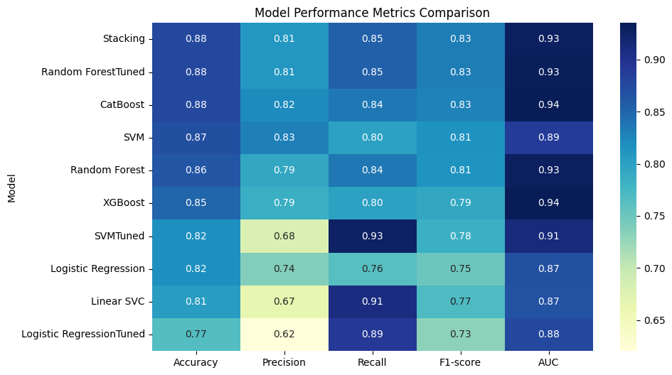

# Diabetes Prediction Project - GTC ML Project

## 📌 Project Overview
This project aims to **predict diabetes in patients** using machine learning models.  
The goal is to explore the dataset, perform feature engineering, train multiple models, and evaluate their performance for **early diabetes detection**.

---

## 📂 Repository Structure
- `diabetes.csv` → The raw dataset containing patient medical data  
- `Diabetes.ipynb` → Jupyter Notebook containing all steps:
  - Exploratory Data Analysis (EDA)  
  - Data Visualization  
  - Data Preprocessing & Feature Engineering  
  - Train/Test Split & Scaling  
  - Model Training & Hyperparameter Tuning  
  - Model Evaluation  
  - Diabetes Prediction Engine
- `model_performance_comparison.png` → Heatmap of model performance metrics
- `README.md` → Project description and instructions  

---

## ⚙️ Prerequisites
- Python 3.x  
- Jupyter Notebook or Google Colab  

**Python Libraries:**
- pandas  
- numpy  
- matplotlib  
- seaborn  
- scikit-learn  
- xgboost  
- catboost  

---

## 🔑 Key Steps

### 1️⃣ Exploratory Data Analysis (EDA)
- Summary statistics  
- Missing values check  
- Correlation analysis  
- Outcome distribution visualization  
- Feature distribution and relationship plots (`Glucose`, `BMI`, `Age`)  

### 2️⃣ Data Preprocessing & Feature Engineering
- Dropped weak/noisy features: `SkinThickness`, `BloodPressure`  
- Created interaction features:
  - `Glucose_BMI = Glucose * BMI`  
  - `Glucose_squared = Glucose²`  
  - `BMI_squared = BMI²`  
  - `Glucose_Age = Glucose * Age`  
  - `BMI_DPF = BMI * DiabetesPedigreeFunction`  
- StandardScaler applied for feature scaling  
- Train/Test split: **80/20**  

### 3️⃣ Model Training & Hyperparameter Tuning
Models used:  
- Logistic Regression  
- Support Vector Machine (SVM)  
- Random Forest  
- XGBoost  
- CatBoost  
- Voting Classifier (Soft)  
- Stacking Classifier  

Hyperparameter tuning with **GridSearchCV** for:
- SVM  
- Logistic Regression  
- Random Forest  

---

## 📊 Model Evaluation

| Model                 | Accuracy | Precision | Recall  | F1-score | AUC   |
| --------------------- | -------- | --------- | ------- | -------- | ----- |
| Stacking              | 0.779    | 0.706     | 0.655   | 0.679    | 0.836 |
| Random Forest         | 0.766    | 0.656     | 0.727   | 0.690    | 0.839 |
| Logistic Regression   | 0.766    | 0.673     | 0.673   | 0.673    | 0.814 |
| XGBoost               | 0.747    | 0.618     | 0.764   | 0.683    | 0.790 |
| CatBoost              | 0.747    | 0.629     | 0.709   | 0.667    | 0.812 |
| Voting                | 0.753    | 0.639     | 0.709   | 0.672    | 0.837 |
| **SVM Tuned (SVMTT)** | 0.714    | 0.573     | 0.782   | 0.662    | 0.810 |

### Model Performance Metrics Comparison



---

## 📈 Key Insights
- Higher **Glucose** and **BMI** strongly correlate with diabetes.  
- Older age increases diabetes risk.  
- **SVM Tuned (SVMTT)** achieved the highest **Recall (0.782)** → crucial for minimizing false negatives in medical datasets.  
- **XGBoost** and **Random Forest** maintain high Recall despite slightly lower Accuracy.  
- **Stacking Classifier** achieved the highest Accuracy (0.779) but lower Recall (0.655).  
- Final model selection depends on balancing **Accuracy** and **Recall** according to project goals.

---

## 🚀 Diabetes Prediction Engine
- Predicts diabetes for new patients using the engineered features and trained model.  
- Features required:  
  `Pregnancies`, `Glucose`, `Insulin`, `BMI`, `DiabetesPedigreeFunction`, `Age`  

```python
prediction = predict_diabetes_final(new_patient_data)
